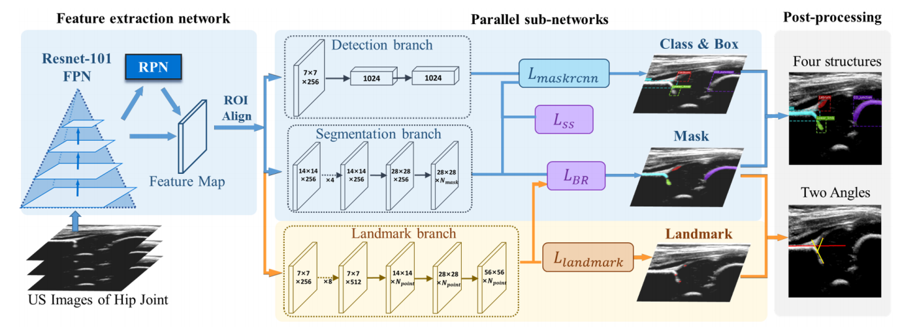
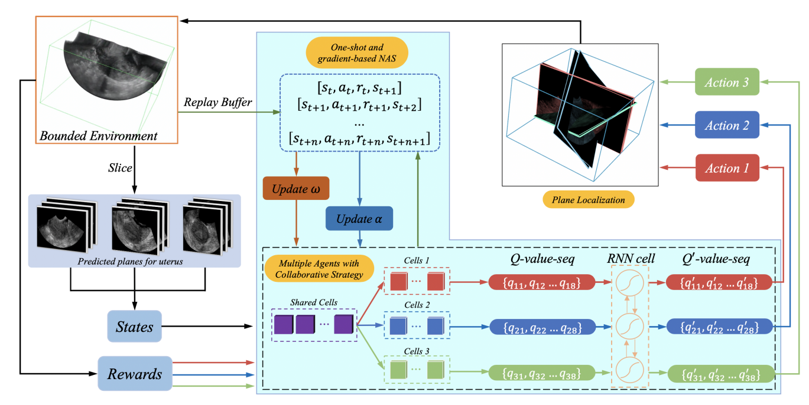
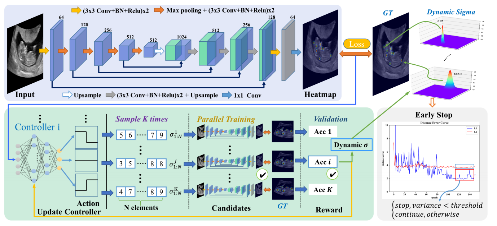
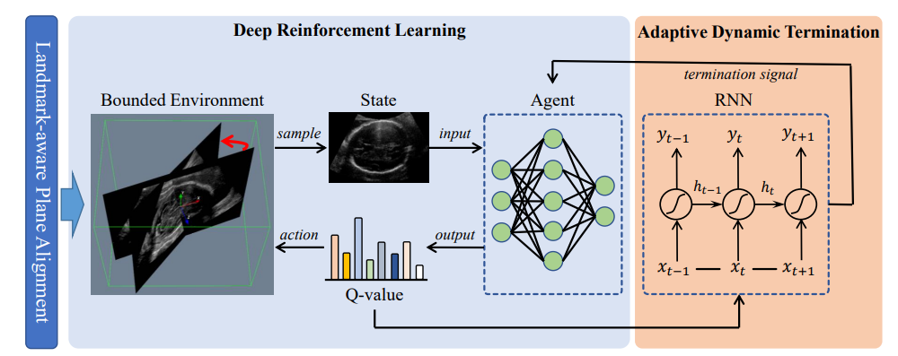
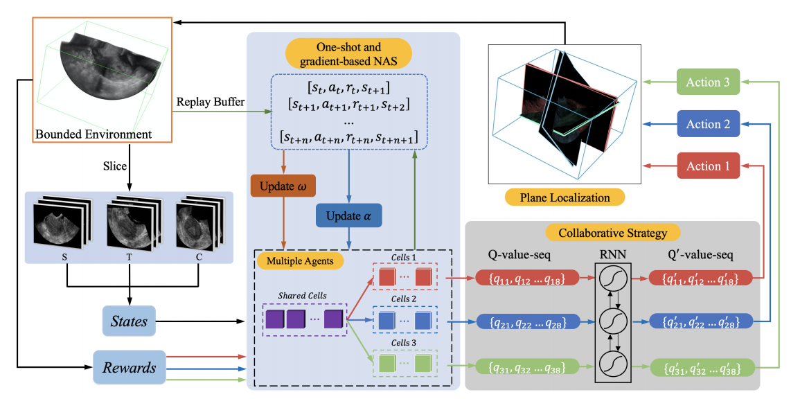
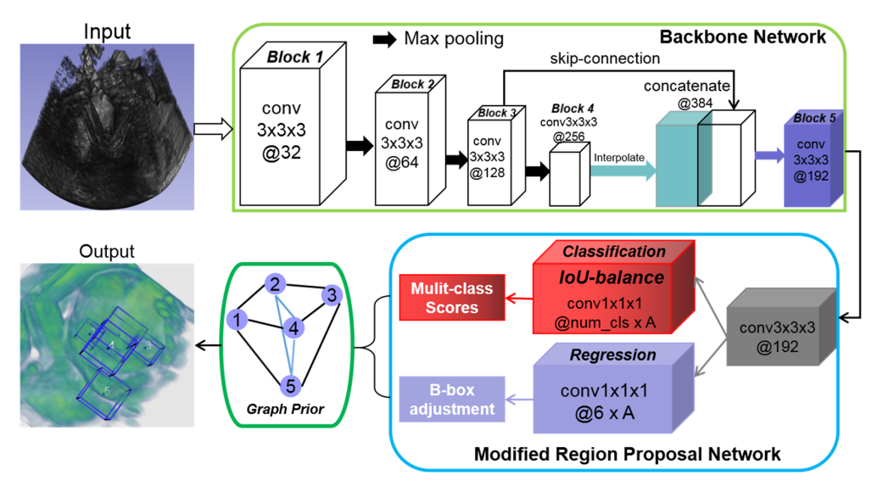
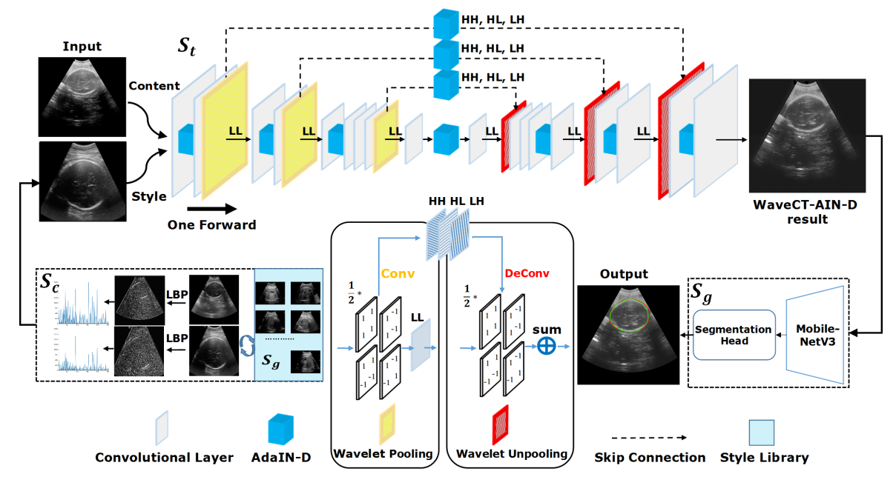

<!DOCTYPE HTML>
<head>
<meta http-equiv="Content-Type" content="text/html;charset=utf-8" />

<meta name="author" content="Yuhao Huang"> 
<meta name="description" content="Yuhao Huang's home page">

  <link rel="stylesheet" href="jemdoc.css" type="text/css">
  <link rel="icon" type="image/png" href="images/seal_icon.png">
<title>Yuhao Huang , Shenzhen University</title>
</head>
<body>

 <a href="https://github.com/yuhoo0302" class="github-corner"><svg width="80" height="80" viewBox="0 0 250 250" style="fill:#FD6C6C; color:#fff; position: absolute; top: 0; border: 0; right: 0;"><path d="M0,0 L115,115 L130,115 L142,142 L250,250 L250,0 Z"></path><path d="M128.3,109.0 C113.8,99.7 119.0,89.6 119.0,89.6 C122.0,82.7 120.5,78.6 120.5,78.6 C119.2,72.0 123.4,76.3 123.4,76.3 C127.3,80.9 125.5,87.3 125.5,87.3 C122.9,97.6 130.6,101.9 134.4,103.2" fill="currentColor" style="transform-origin: 130px 106px;" class="octo-arm"></path><path d="M115.0,115.0 C114.9,115.1 118.7,116.5 119.8,115.4 L133.7,101.6 C136.9,99.2 139.9,98.4 142.2,98.6 C133.8,88.0 127.5,74.4 143.8,58.0 C148.5,53.4 154.0,51.2 159.7,51.0 C160.3,49.4 163.2,43.6 171.4,40.1 C171.4,40.1 176.1,42.5 178.8,56.2 C183.1,58.6 187.2,61.8 190.9,65.4 C194.5,69.0 197.7,73.2 200.1,77.6 C213.8,80.2 216.3,84.9 216.3,84.9 C212.7,93.1 206.9,96.0 205.4,96.6 C205.1,102.4 203.0,107.8 198.3,112.5 C181.9,128.9 168.3,122.5 157.7,114.1 C157.9,116.9 156.7,120.9 152.7,124.9 L141.0,136.5 C139.8,137.7 141.6,141.9 141.8,141.8 Z" fill="currentColor" class="octo-body"></path></svg></a>

<table>
	<tbody>
		<tr>
			<td width="670">
				
					
					<h1>Yuhao Huang</h1><h1>
				</h1>

				<h3>Master student</h3>
				

			    MUSIC lab
					School of Biomedical Engineering, Health Science Center 
					Shenzhen University  
					Shenzhen, China 
					 
					Email: yuhoo0302@gmail.com 
				

				
 
          <a href="https://scholar.google.com/citations?user=mciKo6MAAAAJ&hl=zh-CN">Google Scholar</a> &nbsp/&nbsp
          <a href="https://github.com/yuhoo0302">GitHub</a>
				

			</td>
			<td>
				 
			</td>
		</tr><tr>
	</tr></tbody>
</table>

<h2>Biography [<a href="https://drive.google.com/open?id=1IaAzlrAq7rtnUxLw_D7rh7b4-Q5311VW">CV</a>]</h2>

	I am currently a postgraduate student in <a href="http://www.music-bme.net/">MUSIC</a> Lab at School of Biomedical Engineering, Health Science Center, Shenzhen University, supervised by <a href="http://bme.szu.edu.cn/20161/0326/55.html">Prof. Dong Ni</a>.

My research interest is medical image computing. Specifically, I mainly focus on Reinforcement Learning in medical image analysis.

<h2>News</h2>
<ul>	
	
	<li>
		[06/2021] Two papers about weakly-supervised segmentation and 3D freehand reconstruction were accepted by MICCAI 2021 (one early accepted).
	</li>
	
	<li>
		[06/2021] Our paper on segmentation, detection and measurement of infant developmental dysplasia of the hip (DDH) was accepted by IEEE JBHI.
	</li>

	<li>
		[05/2021] Our MICCAI extension paper about searching RL via NAS for multi-plane detection was accepted by Medical Image Analysis.
	</li>
	
	<li>
		[05/2021] Our paper on meta-learning for landmark detection was accepted by IEEE JBHI.
	</li>
	
	<li>
		[03/2021] Our MICCAI extension study on Reinforcement Learning based 3D plane localization was accepted by IEEE TMI.
	</li>
	
	<li>
		[05/2020] Two papers about plane localization in 3D ultrasound and multi-modal classification were accepted by MICCAI 2020 (one early accepted).
	</li>
	
	<li>
		[01/2020] Two papers about style transfer based robust ultrasound image segmentation and 3D ultrasound detection wai accepted by ISBI 2020.
	</li>
	
	<li>
		[09/2019] I started my postgraduate life at <a href="http://www.music-bme.net/">MUSIC</a> Lab at School of Biomedical Engineering, Health Science Center, Shenzhen University, supervised by <a href="http://bme.szu.edu.cn/20161/0326/55.html">Prof. Dong Ni</a>.
	</li>
	
	<li>
		[06/2019] I graduated from Applied Statistics, School of Applied Mathematics, Guangdong University of Technology, and received my B.S.
	</li>
	
</ul>

<h2> Selected Publications | <a href="https://scholar.google.com.hk/citations?user=AuOcVvkAAAAJ&hl=en">Google Scholar</a></h2>
<!--
<a href="http://scholar.google.com/citations?user=PeMuphgAAAAJ">My Google Scholar</a>
-->
<table id="tbPublications" width="100%">
	<tbody>
	<td><b>/*2021*/</b>
	

	</td>

	<tr>
		<td width="306">
		
		</td>				
		<td>
		
<b>Joint Landmark and Structure Learning for Automatic Evaluation of Developmental Dysplasia of the Hip</b>

		
Xindi Hu*, Limin Wang*, Xin Yang, Xu Zhou, Wufeng Xue, Shengfeng Liu, Yan Cao, <b>Yuhao Huang</b>, Shuangping Guo, Ning Shang, Dong Ni, and Ning Gu.

		
<b>IEEE JBHI</b>, 2021. [<a href="https://arxiv.org/pdf/2106.05458.pdf">paper</a>] 

		</td>
	</tr>
	<tr>&nbsp</tr>
    	<tr>&nbsp</tr>
    	<tr>&nbsp</tr>
		

	<tr>
		<td width="306">
		
		</td>				
		<td>
		
<b>Searching Collaborative Agents for Multi-plane Localization in 3D Ultrasound</b>

		
Xin Yang*, <b>Yuhao Huang*</b>, Ruobing Huang, Haoran Dou, Rui Li, Jikuan Qian, Xiaoqiong Huang, Wenlong Shi, Chaoyu Chen, Yuanji Zhang, Haixia Wang, Yi Xiong, Dong Ni.

		
<b>Medical Image Analysis</b>, 2021. [<a href="https://www.sciencedirect.com/science/article/pii/S1361841521001651">MedIA version</a>][<a href="https://arxiv.org/pdf/2105.10626.pdf">Arxiv version</a>]

		</td>
	</tr>
	<tr>&nbsp</tr>
    	<tr>&nbsp</tr>
    	<tr>&nbsp</tr>
		
	<tr>
		<td width="306">
		
		</td>				
		<td>
		
<b>Learn Fine-grained Adaptive Loss for Multiple Anatomical Landmark Detection in Medical Images</b>

		
Guangquan Zhou*, Juzheng Miao*, Xin Yang, Rui Li, En-Ze Huo, Wenlong Shi, <b>Huang Yuhao</b>, Jikuan Qian, Chaoyu Chen, Dong Ni*.

		
<b>IEEE JBHI</b>, 2021. [<a href="https://arxiv.org/pdf/2105.09124.pdf">paper</a>] 

		</td>
	</tr>
	<tr>&nbsp</tr>
    	<tr>&nbsp</tr>
    	<tr>&nbsp</tr>

		
	<tr>
		<td width="306">
		
		</td>				
		<td>
		
<b>Agent with Warm Start and Adaptive Dynamic Termination for Plane Localization in 3D Ultrasound</b>

		
Xin Yang*, Haoran Dou*, Ruobing Huang, Wufeng Xue, <b>Huang Yuhao</b>, Jikuan Qian, Yuanji Zhang, Huanjia Luo, Huizhi Guo, Tianfu Wang, Yi Xiong, Dong Ni.

		
<b>IEEE TMI</b>, 2021. [<a href="https://arxiv.org/pdf/2103.14502.pdf">paper</a>] [<a href="https://github.com/wulalago/AgentSPL">code</a>]

		</td>
	</tr>
	<tr>&nbsp</tr>
    	<tr>&nbsp</tr>
    	<tr>&nbsp</tr>
		
		
    
	<td><b>/*2020*/</b>
	

	</td>
		
	<tr>
		<td width="306">
		
		</td>		
		<td>
		
<b>Searching Collaborative Agents for Multi-plane Localization in 3D Ultrasound</b>

		
<b>Huang Yuhao*</b>, Xin Yang*, Rui Li, Jikuan Qian, Xiaoqiong Huang, Wenlong Shi, Haoran Dou, Chaoyu Chen, Yuanji Zhang, Huanjia Luo, Alejandro Frangi, Yi Xiong, Dong Ni.

		
<b>MICCAI</b>, 2020. [<a href="https://link.springer.com/chapter/10.1007/978-3-030-59716-0_53">MICCAI version</a>][<a href="https://arxiv.org/pdf/2101.03711.pdf">Arxiv version</a>]

		</td>
		
	</tr>
	<tr>&nbsp</tr>		
    	<tr>&nbsp</tr>
    	<tr>&nbsp</tr>
		
	<tr>
		<td width="306">
		
		</td>
		<td>
		
<b>Auto-weighting for Breast Cancer Classification in Multimodal Ultrasound</b>

		
Wang Jian*, Miao Juzheng*, Xin Yang, Li Rui, Zhou Guangquan, <b>Huang Yuhao</b>, Lin Zehui, Xue Wufeng, Jia Xiaohong, Zhou Jianqiao, Huang Ruobing, Ni Dong.

		
<b>MICCAI</b>, 2020. [<a href="https://link.springer.com/chapter/10.1007/978-3-030-59725-2_19">MICCAI version</a>][<a href="https://arxiv.org/pdf/2008.03435.pdf">Arxiv version</a>]

		</td>
	</tr>
	<tr>&nbsp</tr>		
  <tr>&nbsp</tr>
  <tr>&nbsp</tr>	
		

	<tr>
		<td width="306">
		
		</td>		
		<td>Chaoyu Chen*, Xin Yang*, Ruobing Huang, Wenlong Shi, Shengfeng Liu, Mingrong Lin, <b>Yuhao Huang</b>, Yong Yang, Yuanji Zhang, Huanjia Luo, Yankai Huang, Yi Xiong, Dong Ni. "Region Proposal Network with Graph Prior and IoU-Balance Loss for Landmark Detection in 3D Ultrasound". <i><b>IEEE ISBI</b></i>, 2020.
		

		
[<a href="https://arxiv.org/pdf/2002.05844.pdf">paper</a>]

		</td>
	</tr>
	<tr>&nbsp</tr>		
    	<tr>&nbsp</tr>
    	<tr>&nbsp</tr>		
		
	<tr>
		<td width="306">
		
		</td>		
		<td>Zhendong Liu*, Xin Yang*, Rui Gao, Shengfeng Liu, Haoran Dou, Shuangchi He, Yuhao Huang, Yankai Huang, Huanjia Luo, Yuanji Zhang, Yi Xiong, Dong Ni. "Remove Appearance Shift for Ultrasound Image Segmentation via Fast and Universal Style Transfer". <i><b>IEEE ISBI</b></i>, 2020.
		

		
[<a href="https://arxiv.org/pdf/2002.05844.pdf">paper</a>]

		</td>
	</tr>
	<tr>&nbsp</tr>		
    	<tr>&nbsp</tr>
    	<tr>&nbsp</tr>
		
		

</tbody></table>

	

	

 &copy; Yuhao Huang | Last updated: 26-Jun-2021

</body></html>
